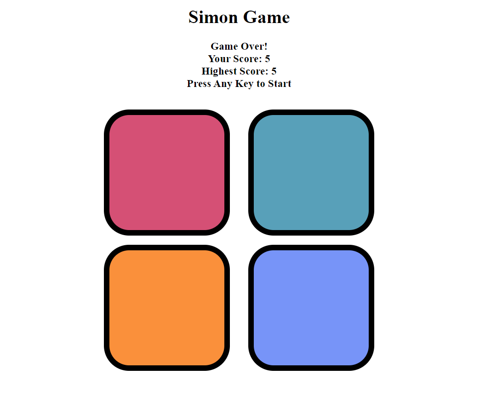

## SIMON GAME
Welcome to Simon Game, a classic memory game that will test and enhance your memory and concentration skills. The objective is simple: remember the sequence of colored boxes that light up and replicate it to advance through the levels. Challenge yourself or compete with friends to see who can reach the highest level!

## How to Play
Press the "Start" button to initiate the game.
Watch and remember the sequence of colored boxes that light up.
Replicate the sequence by clicking on the boxes in the correct order.
Each successful replication advances you to the next level.
Be careful! A wrong move will end the game.

## Screenshot

## Technologies Used
- HTML
- CSS
- JavaScript

## Author
- Vishal Kumar
- rajatrathi029@gmail.com
