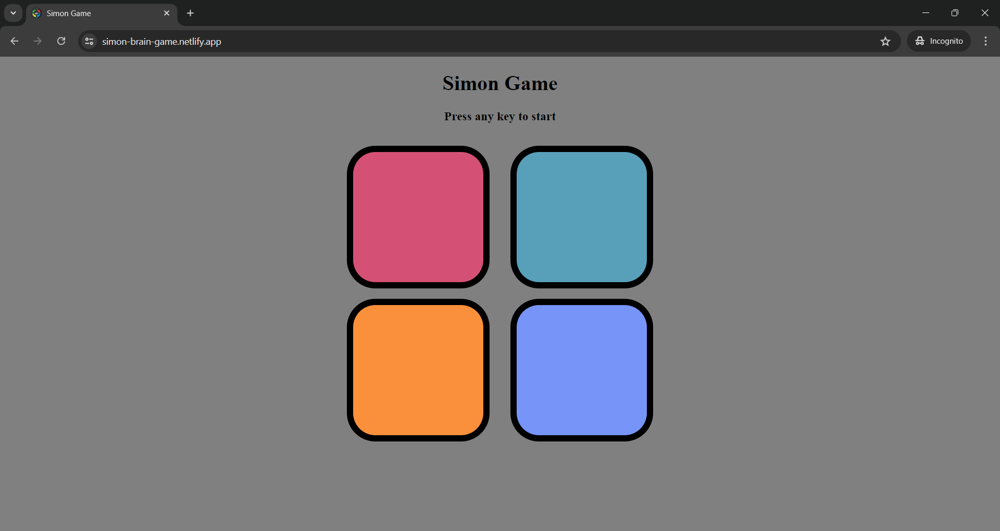

<h1 align="center"><a href="https://simon-brain-game.netlify.app/">SIMON GAME</a></h1>
Welcome to Simon Game, a classic memory game that will test and enhance your memory and concentration skills. The objective is simple: remember the sequence of colored boxes that light up and replicate it to advance through the levels. Challenge yourself or compete with friends to see who can reach the highest level!

## How to Play
Press the "Any Key" to initiate the game.
After the game lights up a color, you need to click the same color using your mouse.
The game will then lights up another color.
Your task is to click on the colors in the exact order shown, repeating the sequence from the beginning each time with the added color.
Each successful replication advances you to the next level.
Be careful! A wrong move will end the game.

## Screenshot

## Technologies Used
- HTML
- CSS
- JavaScript

## Author
- Vishal Kumar
- rajatrathi029@gmail.com
